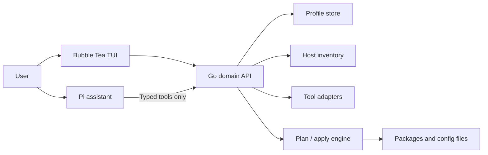

# Pi-Agent Integration Architecture

**Status:** Exploration / proposed roadmap
**Created:** 2026-07-10
**Scope:** Restructure dotfiles around a deterministic profile-and-state engine, then integrate Pi progressively from a read-only companion through an embedded assistant and extensibility platform.

## Executive Summary

The recommended roadmap is a six-stage ladder: first establish a real profile/state architecture, then introduce Pi as an observer, planner, executor, embedded assistant, and finally an extensibility platform.

The permanent ownership rule is:

- Go owns facts, validation, plans, installation, config writes, backups, and rollback.
- Pi owns conversation, intent interpretation, recommendations, and explanations.
- The user owns approval.
- The TUI visualizes the same deterministic state exposed to Pi.



## Integration Ladder

| Stage | Capability | Pi authority | Relative effort |
|---|---|---:|---:|
| 0 | Profile v2, inventory, visual dashboard | None | Large |
| 1 | Read-only Pi companion | Observe | Small |
| 2 | Natural-language change planning | Propose | Medium |
| 3 | Transactional approved execution | Request mutations | Large |
| 4 | Embedded assistant inside the TUI | Guided control | Large |
| 5 | Extensible, agent-assisted platform | Compose validated extensions | Very large |

Stage 2 is the likely product sweet spot. Stages 3–5 should depend on real-world evidence that users want conversational execution, not merely conversational discovery.

---

## Stage 0 — Deterministic Foundation

This stage contains no Pi dependency. It makes the application ready for any agent integration while improving the existing TUI.

### Why It Is Necessary

The current profile contains only name, theme, navigation style, keyboard style, and timestamps. Tool settings are stored separately, installation status is an application cache, and hotkey customizations are stored in another per-user structure.

That means “switch profile” currently does not mean “activate this terminal environment.” It primarily changes global preferences and asks the user to run installation again.

### Profile v2

A profile becomes desired state:

```json
{
  "schema_version": 2,
  "id": "work",
  "name": "Work",
  "preferences": {
    "theme": "catppuccin-mocha",
    "navigation": "vim",
    "keyboard": "macos"
  },
  "tools": {
    "ghostty": {
      "enabled": true,
      "install_policy": "ensure",
      "settings": {
        "font_size": 14,
        "opacity": 94
      }
    },
    "tmux": {
      "enabled": true,
      "install_policy": "ensure",
      "settings": {
        "prefix": "ctrl-a",
        "mouse": true
      }
    }
  },
  "aliases": {
    "gco": "git checkout"
  },
  "hotkey_favorites": [
    "tmux:new-window",
    "zsh:fuzzy-history"
  ],
  "platform_overrides": {
    "linux": {},
    "macos": {}
  }
}
```

Important switching semantics:

- `enabled` means configuration should be active for the profile.
- `install_policy: ensure` means install if missing.
- Switching profiles does not uninstall extra tools.
- Uninstallation is a separate, explicitly destructive reconciliation action.
- `--config-only` switches configuration without installing packages.
- Unsupported settings produce warnings, not silently altered output.

### Core Domain Objects

Add five reusable concepts:

- `Profile`: desired portable state.
- `HostSnapshot`: actual installed/configured state at a point in time.
- `ToolAdapter`: installation detection, config schema, rendering, parsing, validation, hotkeys, commands, and health checks.
- `ChangePlan`: ordered operations and their effects.
- `ApplyRecord`: result, backups, warnings, and rollback status.

A tool’s visual state should be one of:

- Installed and matching
- Installed with drift
- Installed but unconfigured
- Required but missing
- Present but not part of profile
- Unsupported on this platform
- Detection error

### Proposed Domain API

The TUI and future Pi tools should use the same interface:

```text
dotfiles state snapshot --json
dotfiles catalog tools --json
dotfiles catalog hotkeys --json
dotfiles catalog commands --json

dotfiles profile list --json
dotfiles profile show <name> --json
dotfiles profile create <name> --json
dotfiles profile clone <source> <target> --json
dotfiles profile compare <left> <right> --json
dotfiles profile export <name>
dotfiles profile import <file>

dotfiles plan create --profile <name> --patch <file> --json
dotfiles plan show <id> --json
dotfiles plan apply <id>
```

Internally, this should be a Go package API first and CLI JSON second—the CLI is merely an adapter.

### Visual Result

The management screen becomes a desired-versus-actual dashboard:

| Tool | Profile | Installed | Config | Status |
|---|---|---:|---:|---|
| Ghostty | Enabled | Yes | Matching | Healthy |
| tmux | Enabled | Yes | Drifted | Review |
| Neovim | Enabled | No | — | Missing |
| OBS | Disabled | Yes | Unmanaged | Extra |

The existing Manage, Users, and Hotkeys screens then become different views over one state model rather than separate stores.

### Exit Criteria

- Existing profiles migrate without data loss.
- Inventory is side-effect-free and produces stable JSON.
- Profile switching is atomic for managed configuration files.
- Every displayed hotkey and command has a known source.
- The application remains fully usable offline and without AI.

---

## Stage 1 — Read-Only Pi Companion

This is the safest basic integration.

Ship a Pi package such as `@tekierz/dotfiles-pi` containing:

- A dotfiles-specific system prompt or skill.
- Read-only custom tools.
- Optional slash commands.
- Formatting for tool inventory, profiles, and hotkeys.

Pi supports custom typed tools and extensions through its SDK. The SDK can also disable built-in tools while retaining only application-specific tools using `noTools: "builtin"`. See the [Pi SDK documentation](https://pi.dev/docs/latest/sdk).

### Tools

```text
dotfiles_get_snapshot
dotfiles_list_profiles
dotfiles_show_profile
dotfiles_compare_profiles
dotfiles_get_tool
dotfiles_search_hotkeys
dotfiles_search_commands
dotfiles_explain_drift
```

### Example Experiences

> What terminal tools do I have installed?

> Which profile uses vim navigation?

> What is my shortcut for opening a new tmux window?

> Why does my Ghostty configuration show as drifted?

> Compare my Work and Personal profiles.

Pi receives structured state, not arbitrary config files. The Go engine performs detection and returns redacted JSON.

### Security Boundary

In the dedicated dotfiles agent session:

- Disable Pi’s built-in `bash`, `write`, and `edit` tools.
- Expose only read-only dotfiles tools.
- Redact credentials, tokens, private paths, and config values marked sensitive.
- Never place arbitrary file contents into the system prompt.
- Treat tool descriptions, package metadata, and config comments as untrusted data.

This matters because Pi itself runs with the permissions of its process and does not provide a general built-in OS permission boundary. See the [Pi repository security notes](https://github.com/earendil-works/pi#permissions--containerization).

### Exit Criteria

- The agent cannot mutate application or host state.
- All inventory answers are backed by tool results.
- Pi being missing, unconfigured, or offline does not affect the TUI.
- Snapshot data sent to the model is visible to the user through a diagnostic command.

---

## Stage 2 — Natural-Language Planning

Pi can now translate intent into a typed `ProfilePatch`, but still cannot apply it.

### Example

User:

> Make Ghostty slightly more transparent, use vim navigation, and install fzf if it is missing.

Pi submits:

```json
{
  "profile": "work",
  "changes": [
    {
      "op": "replace",
      "path": "/preferences/navigation",
      "value": "vim"
    },
    {
      "op": "replace",
      "path": "/tools/ghostty/settings/opacity",
      "value": 90
    },
    {
      "op": "replace",
      "path": "/tools/fzf/install_policy",
      "value": "ensure"
    }
  ]
}
```

The Go engine then:

1. Validates paths and values against tool schemas.
2. Resolves platform-specific behavior.
3. Takes a host snapshot.
4. Produces a deterministic plan.
5. Renders the plan in both JSON and a human-friendly diff.

Pi never writes config text or generates shell commands.

### Additional Tools

```text
dotfiles_get_profile_schema
dotfiles_get_tool_schema
dotfiles_validate_patch
dotfiles_create_plan
dotfiles_explain_plan
```

### Plan Example

```text
Plan 01K2...

Profile changes:
  navigation: emacs → vim
  ghostty.opacity: 94 → 90

Host changes:
  install fzf using Homebrew
  regenerate ~/.config/ghostty/config
  regenerate ~/.zshrc

Risks:
  package installation requires network access
  ~/.zshrc contains unmanaged user content

Rollback:
  Ghostty config: automatic
  Zsh config: automatic
  Homebrew installation: not automatically reversed
```

Package operations should be explicitly identified as potentially non-reversible. File changes can be transactional; package-manager operations generally cannot promise perfect rollback.

### Exit Criteria

- The same profile patch and host snapshot always produce the same plan.
- Invalid settings fail before a plan is created.
- Plans contain no commands invented by the model.
- No plan can be applied through an agent tool.
- Plans expire when the host snapshot changes materially.

This is a strong first public milestone: users gain natural-language customization without giving the model mutation authority.

---

## Stage 3 — Approved Transactional Execution

Pi may request that a plan be applied, but application occurs only after an interactive human approval.

### Plan Lifecycle

```text
Draft → Validated → Reviewed → Approved → Applying → Verified
                                              ↘ Failed → Rolled back
```

Every plan contains:

- Plan ID
- Profile revision
- Host snapshot hash
- Ordered operations
- Required privileges
- Files affected
- Backup strategy
- Non-reversible operations
- Expiration time

### Approval Design

The model must never be able to manufacture approval.

Recommended flow:

1. Pi creates a plan.
2. The host displays a native confirmation UI.
3. User reviews the exact diff.
4. The host records approval locally.
5. Go applies the plan directly.
6. Pi receives the result after completion.

The approval token or capability should never appear in conversation history or model-visible tool results.

For standalone Pi usage, the extension can display an interactive confirmation and execute the approved call inside extension code. In non-interactive or headless mode, mutation is refused.

### Transaction Behavior

For config files:

1. Verify the snapshot is still current.
2. Create a backup.
3. Render changes into staging files.
4. Parse or validate generated configs where supported.
5. Atomically replace files.
6. Run health checks.
7. Roll back changed files on failure.

For packages:

- Complete package operations before dependent config writes.
- Clearly mark installs/removals as non-atomic.
- Never automatically uninstall on profile switch.
- Require a second destructive confirmation for removal.

### Audit Records

Store a local record under the dotfiles config directory:

```json
{
  "plan_id": "01K2...",
  "profile": "work",
  "initiated_by": "pi",
  "approved_by": "interactive-user",
  "started_at": "...",
  "completed_at": "...",
  "operations": [],
  "result": "verified"
}
```

Do not store model reasoning or credentials.

### Exit Criteria

- Stale plans are rejected.
- Config write failures restore the previous files.
- Interrupted executions can be diagnosed and recovered.
- Privilege escalation remains visible and interactive.
- There is no raw-shell escape path from Pi to the operating system.
- Adversarial prompts cannot bypass confirmation.

---

## Stage 4 — Pi Embedded in the Go TUI

At this stage, the user no longer needs to open Pi separately. The Bubble Tea application gets an Assistant screen or collapsible side panel.

Pi supports headless JSONL RPC over stdin/stdout with streamed lifecycle and tool events, which fits a Go subprocess integration. See the [Pi RPC documentation](https://pi.dev/docs/latest/rpc).

For production, use a small Bun/TypeScript sidecar built with the Pi SDK rather than launching an unrestricted stock Pi session. That sidecar can enforce:

```typescript
createAgentSession({
  noTools: "builtin",
  customTools: dotfilesTools
})
```

### TUI Experience

The assistant can:

- Answer questions about the highlighted tool.
- Explain individual settings.
- Draft changes from conversation.
- Surface a native plan-diff modal.
- Stream progress during approved application.
- Navigate the TUI to relevant tools, profiles, or hotkeys.

Suggested layout:

```text
┌ Tools ───────────┬ Current State ─────────────┬ Assistant ───────────────┐
│ Ghostty          │ Installed       ✓          │ “Ghostty is installed,  │
│ tmux             │ Profile: Work              │ but opacity differs from│
│ Neovim           │ Opacity: 94 → desired 90   │ the Work profile.”      │
│ ...              │ Drift detected             │                         │
└──────────────────┴─────────────────────────────┴──────────────────────────┘
```

### Event Mapping

- Pi `message_update` → streaming assistant text.
- `tool_execution_start/end` → action cards or spinners.
- `plan_created` → native plan diff.
- Apply progress → existing Bubble Tea async messages.
- Sidecar exit → recoverable “assistant unavailable” state.

### Operational Boundaries

- Go does not read or copy Pi credentials.
- Authentication remains owned by Pi’s credential storage.
- The sidecar starts only when the assistant is opened.
- Crashes cannot terminate the main TUI.
- Users can disable the integration completely.
- All non-agent workflows remain available.

### Exit Criteria

- The TUI remains responsive while Pi streams.
- Sidecar cancellation and teardown are reliable.
- Conversation state is independent from profile state.
- A Pi or provider outage does not block configuration.
- Native confirmation remains the only mutation gate.

---

## Stage 5 — Deep, Extensible Integration

The final stage turns dotfiles into a terminal-environment platform rather than merely an installer with an assistant.

### Declarative Tool Packs

A tool pack describes:

- Packages by platform
- Installation detection
- Config locations
- Typed settings
- Rendering strategy
- Validation commands
- Hotkeys and commands
- Health checks
- Migration rules
- Sensitive fields

Pi could help users draft a local adapter:

> Add WezTerm to my profiles and import my existing configuration.

Generated adapters must remain inactive until:

1. Their manifest validates.
2. Generated output is previewed.
3. Commands pass a policy check.
4. Tests or health checks pass.
5. The user explicitly enables the adapter.

First-party adapters can contain reviewed Go behavior. User-created adapters should be declarative and constrained; they should not become arbitrary model-authored shell scripts.

### Deeper Profile Capabilities

- Profile inheritance: `laptop` extends `personal`.
- Cross-platform overrides.
- Import current machine as a profile.
- Compare a machine against a profile.
- Sync/export profiles without secrets.
- Detect and explain drift.
- Conflict detection across hotkeys.
- Suggested remappings based on installed tools.
- Profile-aware command palette.
- Optional background drift notifications.

### Agent-Assisted Workflows

Examples:

> Create a lightweight Raspberry Pi profile based on Work.

> Import this machine, but exclude GUI applications.

> Find conflicting shortcuts between tmux, Ghostty, and Neovim.

> Show everything Personal has that Work does not.

> Prepare my Work profile for a clean Debian machine.

The agent composes existing capabilities; it does not bypass the profile engine.

### Exit Criteria

- Third-party adapters have an explicit trust model.
- Profile inheritance has deterministic resolution rules.
- Sensitive values never enter portable profiles by default.
- Cross-platform plans clearly identify unsupported settings.
- Agent-created extensions cannot execute arbitrary code before approval.

---

## Recommended Implementation Sequence

Group the work into three product milestones:

1. **State platform:** Stage 0 plus the visual desired/actual dashboard.
2. **Pi-assisted preview:** Stages 1 and 2, shipped as an optional developer preview.
3. **Trusted assistant:** Stage 3, followed by Stage 4 only after the plan/apply engine has extensive field usage.

Stage 5 should remain a direction rather than an upfront commitment.

The migration can be incremental:

- Expand the existing `UserProfile` into Profile v2.
- Turn the current installed cache into `HostSnapshot`.
- Extend the existing `Tool` registry with adapter capabilities.
- Fold the current per-user aliases/favorites into profiles.
- Make Manage, Users, and Hotkeys consume the same domain state.
- Add the Pi boundary only after the JSON contracts are stable.

## Architectural Litmus Test

If Pi is removed, the application should still know exactly what the user wants, what the machine has, what will change, and how to apply it safely.

Pi should make that system dramatically easier to use—not become the only component capable of understanding it.
