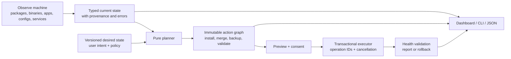

# Pre-deployment release audit — 2026-07-09

## Executive verdict

**Release decision: NO-GO.** The current branch is not safe for ordinary testing on a
preconfigured primary Mac, friends-and-family deployment, or a mock-enterprise setup.
It is suitable only for read-only exploration or destructive testing in a disposable
user account/VM with an external backup.

The project has a strong visual foundation, a meaningful Go/TUI implementation, useful
package abstractions, and a substantial test suite. It should be stabilized in place,
not rewritten. The immediate problem is that the dashboard is not an accurate or safe
reconciliation layer: it does not reliably observe the current machine, its install
plan can omit or misinstall tools, and its narrow configuration models can replace
broad real-world configuration files without a complete rollback point.

The missing Pi, OpenCode, Codex, Cursor Agent, T3 Code, and Hermes integrations are real:
they are specifications only, not implemented features. An older installed binary is
also shadowing this checkout, but upgrading that binary would not make those integrations
appear because they do not exist in current source.

### Direct answer about the local `dotfiles` command

| Command/source | Observed version | Interpretation |
|---|---|---|
| First `dotfiles` on the login-shell `PATH` | `/opt/homebrew/bin/dotfiles`, version `2.0.1` | Yes: the ordinary command is the older Homebrew build. |
| Second `dotfiles` on `PATH` | `~/.local/bin/dotfiles`, version `2.0.0-dev` | Another stale installation can shadow builds depending on `PATH`. The Go installer itself creates this ambiguity by copying its running executable into `~/.local/bin`. |
| Current checkout build | `./bin/dotfiles`, version `7ddcb99` | Matches the current branch commit used for this audit. |
| Current branch vs `main` | 32 commits ahead, no left-side divergence | The audit covers work newer than `main` and newer than the installed formula. |

The settings mismatch is not just an old-build symptom. The current Manage dashboard
loads `tools/manage.json` or compiled defaults, not the installed applications' active
configuration files. On the audited Mac, Ghostty was already configured, but
`manage.json` did not exist, so the UI displayed defaults that disagreed with the real
font, size, opacity, scrollback, close confirmation, and many unmodeled settings.

## Scope and assurance

The baseline at `7ddcb99` contains **195 tracked files and 51,980 lines**. Three
non-overlapping primary reviews read the complete tracked baseline:

| Partition | Files | Lines | Primary report |
|---|---:|---:|---|
| Core CLI/runtime/config/backup/package/scripts/themes | 46 | 10,660 | `tasks/audit-work/primary-core-runtime.md` |
| TUI/dashboard and all UI tests/docs | 87 | 23,433 | `tasks/audit-work/primary-ui-dashboard.md` |
| Tools/generators/legacy installer/docs/CI/release/tasks | 62 | 17,887 | `tasks/audit-work/primary-tools-docs-release.md` |
| **Total** | **195** | **51,980** | Complete tracked baseline |

The tools primary report originally printed 17,900 lines because it listed the baseline
`tasks/todo.md` as 165 lines instead of its actual 152. The file content was reviewed;
the corrected partition total above reconciles exactly with Git and the other two
partitions.

Independent agents then checked reachability, severity, omissions, and refutations.
That process materially changed the result: for example, it refuted the claim that the
live Updates screen currently invokes the manager-wide update path, downgraded its apt
deadlock to latent dead code, and found a more serious omitted issue in tool installation.

No production code was modified. Audit artifacts and the active task plan are the only
worktree changes.

## Readiness scorecard

These scores describe release readiness, not the amount of work already invested.

| Area | Score | Assessment |
|---|---:|---|
| Installer correctness | 2/10 | Core packages are omitted from the install plan; custom tool installers are bypassed. |
| Existing-config safety | 2/10 | Narrow defaults can replace broad real files; backups do not cover the mutation surface. |
| Feature/settings completeness | 3/10 | 30 tools are registered, but only 11 have meaningful config behavior and six planned integrations are absent. |
| Visual design | 7/10 | Distinctive, cohesive 16-theme foundation and thoughtful component work. |
| Terminal UX/accessibility | 4/10 | 80x24 clips essential controls; long lists lack viewports; status is slow and ambiguous. |
| CLI/hotkey ergonomics | 4/10 | Useful commands/viewer, but weak automation contracts, stale syntax, partial nav semantics, and dead-end alias UI. |
| Architecture/maintainability | 5/10 | Good seams exist, but state, plan, ownership, execution, UI, and docs are hand-coupled. |
| Tests/release engineering | 3/10 | Build/vet pass, but macOS tests are red and no reproducible signed release pipeline exists. |
| Documentation accuracy | 4/10 | Multiple active docs, skills, tasks, and the legacy product contradict current behavior. |
| Mock-enterprise readiness | 1/10 | No policy, RBAC, audit, noninteractive plan/apply, secrets boundary, provenance, or supported fleet matrix. |

## Release-blocking finding clusters

The table deliberately deduplicates overlapping primary reports. The detailed ledgers
retain individual findings and line references.

| Priority | Finding cluster | Concrete impact | Required outcome |
|---|---|---|---|
| P0 | Install plan omits the core terminal tools | Quick/Deep Dive installs configuration for Ghostty, tmux, zsh, Neovim, Git, Yazi, and FZF without putting those packages through the package installer. A fresh machine can finish without its core executables. | One immutable registry-driven plan must contain every package, config mutation, ownership decision, precondition, and validation. Preview and execution must use that same plan. |
| P0 | Dashboard bypasses custom `Tool.Install` behavior | Wizard and Manage call the package manager directly. Claude Code therefore installs its Node prerequisite but skips `npm install -g @anthropic-ai/claude-code`, can report success, and may write MCP config without a `claude` binary. Planned curl/npm installers would fail the same way. | Execute typed tool install actions, including verified custom steps, rather than treating package metadata as the whole installer. |
| P0 | Existing settings are not imported or preserved | Manage/standalone use `manage.json` or defaults. Full-file writers can erase Git identity/LFS/includes/credentials/aliases and Ghostty padding/keybindings/clipboard/window settings after changing one visible field. | Discover active config sources, import known values, preserve unknown values, use managed blocks/includes where possible, and require preview/ownership consent for replacement. |
| P0 | Theme changes have a destructive cross-tool blast radius | One theme change schedules all ten generators plus Claude, including uninstalled/unmanaged tools, without backup or preview. Git and Ghostty can be replaced by default-derived files. | Theme changes may touch only explicitly managed, theme-dependent artifacts. The user must see the exact diff and rollback point. |
| P0 | Backup/rollback is incomplete and fail-open | Install continues after backup failure. Only six fixed paths are captured, while Manage/standalone saves have no backup and generators write many more paths. Directory restore is nontransactional and existing files may retain unsafe modes. | Derive backup scope from the immutable mutation plan, fail closed, validate/hash it, apply atomically, and prove byte-identical rollback for every destination. |
| P1 | Whole-file writer primitive is unsafe | Common writers truncate in place, follow symlinks, are not atomic, and do not enforce mode on existing files. | Central no-follow, temp/sync/chmod/rename writer plus format validation and per-tool ownership policy. |
| P1 | Uninstall deletes unowned basename matches | Six generic names are removed from `~/.local/bin` and `/usr/local/bin` without a manifest, checksum, or target verification. | Remove only artifacts recorded as owned by this product; preview and verify every removal. |
| P1 | Existing global config can silently disable safety defaults | Partial old JSON is decoded into zero values, turning on-disk omissions into `AutoBackup=false` and zero retention. | Versioned schema migration with default-overlay, validation, and fixtures for every prior version. |
| P1 | Detection state is slow and semantically wrong | First Manage load took roughly 13–22 seconds. A local zsh 5.9 install was labeled “NOT INSTALLED” because optional bundle packages were missing. | Structured observations with provenance: primary installed, external, partial dependency, config found/adopted/valid, service/auth ready, and detection error. Render progressively. |
| P1 | Active configuration is not observed with provenance | Ghostty's supported macOS source chain is not represented and the dashboard cannot explain which file wins. Without source/version provenance, safe adoption and validation are impossible. | Version-aware config-source discovery, parse/validation, and tested platform precedence. |
| P1 | TUI operation and layout state is unreliable | Screen-local async results can be dropped after navigation; rapid actions can duplicate work; concurrent saves can complete out of order. Standard 80x24 clips Save/Esc/q and truncates tool identity. | App-level operation coordinator with IDs/single-flight/versioned results; responsive viewports and minimum-size fallbacks. |
| P1 | fzf advanced input becomes sourced shell code | The raw options field is interpolated into a sourced zsh file without a safe typed boundary. | Remove raw shell interpolation or store validated argv-style values; provide an explicit raw-file editor with warnings outside automatic generation. |
| P1 | Legacy Zsh migration can delete appended customizations | The managed-section writer preserves normal content, but a file beginning with the old generated marker is replaced wholesale, including user aliases/exports/functions added later. | Parse only the known legacy generated region, preserve unknown tail content, preview the migration, and back it up immediately. |
| P1 | Tests and release claims are not green on the target platform | macOS tools/UI tests fail on seven stale Glow path expectations even though the production macOS path is correct. CI runs full tests only on Ubuntu, and active task/docs still claim green. | Hermetic cross-platform tests, actual macOS test execution, current docs, and a blocking release gate. |
| P1 | Legacy Bash remains a second drifting product | The 4,346-line installer has separate versions, obsolete Yazi schema, shellcheck debt, mutable remote execution, and behavior that differs from Go. | Freeze/remove it from recommended distribution, retain only a clearly unsupported migration path, then archive it after an upgrade window. |
| P1 | The main binary has competing owners | Homebrew owns `/opt/homebrew/bin/dotfiles`, while the Go install flow self-copies the running binary into `~/.local/bin/dotfiles`; `make install` uses a third prefix. PATH order—not release state—then decides which product runs. | Package managers own the main binary. Separate helper-script installation, stop self-copy, add `doctor` provenance/PATH collision reporting, and migrate only manifest-owned old copies. |
| P1 | Release pipeline is not reproducible | The local Homebrew formula is still 2.0.1; there is no complete release config/workflow, checksums/SBOM/signing, or clean install/upgrade/rollback matrix. | Tagged reproducible artifacts, checksums/signing/provenance/SBOM, tested formula update, and supported-platform evidence. |

## Features and settings completeness

### Current inventory

- **30 registered tools** exist in current source.
- **11 tools** have a writer or meaningful configuration integration: Zsh, Ghostty,
  tmux, Neovim, Yazi, Git, LazyGit, fzf, btop, Glow, and Claude Code MCPs.
- **19 tools** are primarily install/detect entries. Tailscale, Sunshine, Moonlight,
  GUI apps, and many CLI utilities do not yet provide onboarding, settings import,
  service/auth health, or configuration lifecycle.
- **Six planned tools are absent from the registry and dashboard:** Codex CLI, Cursor
  Agent, OpenCode, Pi, T3 Code, and Hermes.

The right target is not hundreds of hand-built checkboxes. The installed Ghostty version
can describe roughly 634 default/documented keys, while Manage exposes eight. Attempting
to encode every upstream option manually would create a permanently stale UI. Use layers:

1. **Essentials:** curated, safe, frequently used settings with imported current values.
2. **Advanced:** searchable, version-aware schema fields with validation and provenance.
3. **Raw/import:** active source chain, preserved unknown keys, native-file access, and a
   guarded raw editor/diff.
4. **Health:** binary/app/package source, dependencies, parse status, managed ownership,
   service/auth readiness, and actionable failures.

### Current configuration behavior by risk

| Group | Current condition | Product direction |
|---|---|---|
| Zsh | A bounded managed section is the best current ownership pattern, but wizard and Manage expose different subsets and hidden defaults can still reset managed behavior. | Retain the managed section; import current managed values; unify the schema and expose plugin/prompt/history/alias provenance. |
| Neovim | Preference overlay is safer, but Plugins is a no-op, preset cloning has broader ownership implications, and only Tokyo Night has a real colorscheme mapping. | Separate preset ownership from editor preferences; implement or remove Plugins; map all themes honestly. |
| Claude Code | MCP merge preserves unrelated top-level JSON better than most writers, but paths, auth/readiness, package install behavior, and unpinned `npx -y` servers are incomplete. | Label it MCP-only today; add install/auth/permissions/provider/provenance health and pin or policy-control MCP packages. |
| Ghostty/tmux/Git/Yazi/LazyGit/btop/Glow | Narrow models commonly replace whole files. Git and Ghostty are the highest-impact examples. | Adopt native includes/managed fragments or parser-preserving merges; never infer whole-file ownership from one edited field. |
| fzf | Product-owned sourced fragment is a reasonable integration boundary, but raw interpolated options are unsafe. | Typed options plus a guarded escape hatch. |
| Tailscale/Sunshine/Moonlight | Package install/detection only. | Add service, login/pairing, network/encoder/firewall, and health flows before calling these integrations complete. |
| Remaining CLI/GUI entries | Mostly install/detect only. | Display truthful capability badges: Install, Detect, Configure, Import, Theme, Service, Auth, Health. |

Version/schema drift also needs focused cleanup: Ghostty now uses `background-blur`
rather than the emitted `background-blur-radius`; the Go Yazi keymap emits the current
nonexistent `select --state=none` action instead of `toggle`; the legacy Yazi schema is
older still; and Claude's registry config-path metadata does not name the file its MCP
merger actually owns. These are not the root cause of the settings mismatch, but they
show why version-aware validation must be part of the settings platform.

### Planned AI integrations

The existing spec must be reworked before implementation:

- Integrations should be **opt-in**, especially for friends/family and managed testing.
- Every installer needs a pinned/verified source policy, exact permissions/data-egress
  disclosure, authentication readiness, update channel, and uninstall ownership.
- Codex supports ChatGPT sign-in or API-key authentication; local and trusted automation
  flows have different credential models. Use the current official
  [Codex CLI](https://developers.openai.com/codex/cli/) and
  [authentication](https://developers.openai.com/codex/auth/) documentation.
- Cursor Agent remains a distinct CLI from the Cursor GUI and is installed as
  `cursor-agent`; verify against the current [Cursor CLI documentation](https://docs.cursor.com/en/cli/overview).
- OpenCode has multiple supported installation routes; prefer a policy-controlled package
  route where possible and verify against [OpenCode CLI documentation](https://opencode.ai/docs/cli/).
- Pi's extension model has substantial power and its security documentation states it has
  no built-in sandbox; do not make it a silent default. See the current
  [Pi documentation](https://pi.dev/docs/latest).
- The planned T3 Code version is already stale: the Homebrew cask was 0.0.28 during this
  audit, rather than 0.0.27 in the spec. See [Homebrew's T3 Code cask](https://formulae.brew.sh/cask/t3-code).

## Aesthetics and terminal UX

### What is working

- The neon-seapunk identity is recognizable and the 16-theme palette is a real asset.
- Main navigation, Manage's two-pane concept, backup confirmation, update streaming,
  hotkey filtering/favorites, and mouse coverage show thoughtful product design.
- The theme picker and consistent config-screen components provide a good foundation for
  a polished local systems tool.

### What is not release-polished

- At 80x24, Manage wraps the installed-count subtitle, clips the footer after
  `I install`, hides Save/Esc/q, and truncates names such as Ghostty and Claude before
  secondary category tags.
- Many theme/config/list screens render full content without a viewport. Selection can
  move to controls the user cannot see; the Deep Dive wheel cannot reach Continue.
- The animated status ornament reads as permanent background work and causes idle redraws.
- The full five-tab icon-and-label bar does not adapt to narrow terminals.
- Color and Nerd Font glyphs carry too much meaning, with no verified reduced-motion,
  low-color, glyph fallback, or contrast mode.
- Navigation-style selection overpromises Vim/Emacs behavior; most controls retain their
  own fixed keys. The selection is not fed into the Zsh/tmux/Yazi generators, and the
  app's Emacs default can coexist with Yazi's compiled Vim default.
- “Click, scroll, and tweak everything” is materially broader than the eleven partial
  integrations and should not be used until capability and ownership are visible.
- A unified theme is not currently unified: Glow collapses/forces visual modes and most
  Neovim themes are partial overrides rather than full colorschemes.

Recommended hierarchy for every tool page:

```text
Tool name + capability badges + observed state
  Current active source and health
  Essentials
  Advanced (searchable/collapsible)
  Unmanaged/raw settings summary
  Preview plan/diff
  Apply with rollback reference
```

The first two new diagnostic interactions should be **“Why is this state shown?”** and
**“Which configuration source is active?”**. They will improve trust more than adding
more unchecked fields.

## CLI commands and hotkeys

The CLI is useful interactively but not yet a stable automation interface:

- Several invalid command forms print help or errors and still return success.
- There is no consistent `--json`, noninteractive plan/apply, dry-run, or deterministic
  exit-code contract.
- `dotfiles theme --list` is invalid; the real command is `dotfiles theme list`, yet the
  Homebrew caveat and an active pre-PR skill still advertise the wrong syntax.
- `status` performs serial package probes and measured 22.23 seconds locally.
- Multi-manager update results retain their source, but the mutation path discards it and
  routes names through one detected manager.

The hotkey viewer is visually useful, but the model needs one source of truth shared by
generated config, viewer, CLI help, and docs. Saved alias data is consumed by the Zsh
generator, so the original claim that it has no consumer was refuted; however, the UI does
not clearly explain that limited scope or apply the alias immediately. Favorite IDs are
derived from display descriptions, meaning copy edits can orphan stored favorites.

Target capabilities:

- searchable current/native/product-resolved bindings with conflict detection;
- explicit scope and provenance for aliases;
- single generated source for help/docs/config tables;
- usable text fallbacks for icons/color;
- stable semantic IDs and migration aliases;
- navigation modes applied consistently or described more narrowly.

## Repository health and verification

### Passing evidence

- `go build ./...`
- `go vet ./...`
- `gofmt` check
- `go mod verify`
- `go mod tidy -diff`
- focused race tests for theme/config snapshots
- `bash -n bin/dotfiles-setup scripts/install-hooks.sh`
- strict audit of the currently installed Homebrew formula
- `git diff --check`
- vulnerability scan found no reachable known Go symbol vulnerability at audit time

### Failing or insufficient evidence

- `go test -race ./...` is red because the tools/UI suites fail on seven macOS Glow
  path/output expectations. No race warning appeared before those failures.
- Full macOS tests are absent from CI; the macOS matrix builds and invokes help only.
- Package and CLI coverage are weak (approximately 25% and 21%); the theme package is 0%.
- `golangci-lint` reports zero after broad global text exclusions suppress many
  substantive categories; this is not equivalent to a clean strict lint run.
- Staticcheck retains an allowlist of deprecations, dead code, and style debt.
- Shellcheck exits nonzero on the legacy installer/hooks with multiple maintainability
  warnings.
- The Go toolchain/dependency set needs a patched, pinned release environment and an SBOM.
- There is no clean-machine install/adopt/reapply/restore/uninstall E2E suite.
- No Linux/Pi hardware evidence or Homebrew upgrade/rollback evidence was available.

Active documentation is not release-authoritative. README mixes Go and legacy behavior;
tool docs overstate config support; duplicate skill trees differ; security docs describe
older CI; the task plan says green despite the current Mac failures; and historical
prototype commentary remains mixed into current architecture guidance.

## Recommended target architecture

Keep the existing registry, platform adapters, UI components, and useful tests, but make
the dashboard a projection of explicit state and plans:



A `ToolManifest` should describe identity, risk class, supported versions/platforms,
install providers, required/optional dependencies, detection probes, config source
precedence, typed common/advanced fields, ownership, validation, auth/data-egress,
post-install work, and health checks. Use custom adapters only where formats or lifecycle
require them: Zsh managed blocks, Git includes, Neovim preset overlays, and Claude JSON.

This removes the current need to hand-update registry maps, UI group lists, screen enums,
config structs, translation functions, change detectors, generators, docs, and tests for
every new tool. It also makes “install only” versus “fully configured” visible.

## Repository strategy

**Keep this repository. Do not start over.** The current defects are concentrated in
replaceable contracts—observation, planning, ownership, execution, and release—not in a
fundamentally unusable language or TUI model. A rewrite would discard extensive tests and
edge-case knowledge while recreating the same cross-platform and configuration problems.

Recommended cleanup:

1. Freeze feature additions while destructive paths are replaced.
2. Make the Go application the only supported product.
3. Remove the legacy Bash installer from recommended installation immediately; retain a
   time-boxed, clearly unsupported migration path, then archive it.
4. Collapse duplicate docs/skills and move historical plans to an unmistakable archive.
5. Generate capability docs, settings tables, hotkeys, and test cases from manifests.

A separate repository makes sense only if the mock-enterprise exercise becomes a real
multi-host control plane with remote agents, tenant identity, policy distribution,
secrets, fleet inventory, and audit/event storage. That service should consume a stable
local agent/library from this repository rather than replace it.

## Rename difficulty

**Safe product rename: 8/10** (roughly 8.5/10 if the module, repository, persisted data,
legacy compatibility, and distribution identity all move in one coordinated release).
A display-label-only change is about 3–4/10.

In Git-index content, case-insensitive `dotfiles` references occur **1,168 times across
123 tracked paths**. The effective workspace resolves the tracked `AGENTS.md` link/copy
and therefore reads as **1,195 occurrences across 124 paths**. The blast radius includes
the Go module path, binary and command examples,
Homebrew tap/formula/release assets, GitHub URLs, `~/.config/dotfiles`, backups/manifests,
managed markers, shell scripts, embedded legacy CLI, docs, skills, and tests.

Safe order:

1. Choose and validate the brand, CLI name, package, repository, and domain.
2. Change the display identity while retaining the `dotfiles` binary/config root.
3. Add the new executable with a `dotfiles` compatibility shim for at least one release.
4. Dual-read old/new config roots, migrate atomically with a version and rollback, then
   write only the new root after confirmation.
5. Continue recognizing old managed markers/includes or migrate them idempotently.
6. Publish and test the Homebrew replacement/upgrade/uninstall path.
7. Change the Go module/repository path last, after redirects exist.

Do the rename after configuration ownership and migration primitives are safe but before
friends-and-family distribution. Renaming first would combine branding with a currently
unsafe data migration; renaming after wider deployment multiplies compatibility cases.

## Deployment gates

### Gate 0 — destructive-path freeze

- Disable/hide full-file Save, theme-wide apply, and unsafe uninstall for adopted files.
- Fix custom/core install planning and make confirmation execute the same immutable plan.
- Make failed/incomplete backup a hard stop.
- Fix the current macOS test failures and documentation claims.
- Stop self-copying the Homebrew-owned executable and detect all stale PATH candidates.

### Gate 1 — safe local alpha on disposable and primary hardware

- Current-state import/provenance plus preserve-unknown ownership for every writer.
- Atomic no-follow apply, exact mutation-derived backup, format validation, health check,
  and proven rollback.
- Structured detection/status and progressive sub-two-second dashboard availability.
- Responsive 60x18, 80x24, and 120x40 layout tests with keyboard/mouse/low-color fallback.
- Clean Mac and preconfigured Mac E2E: install, adopt, edit one field, theme, rerun,
  interrupt, restore, uninstall, and byte-for-byte unmanaged-content verification.

### Gate 2 — limited friends-and-family

- Versioned migrations and upgrade/rollback from the last old-name/old-version build.
- macOS Intel/Apple Silicon plus Debian/Arch and Pi/ARM evidence.
- Offline/network/permission/disk-full/symlink/partial-package/interactive-sudo tests.
- Signed/checksummed artifacts, SBOM/provenance, and verified Homebrew release.
- Opt-in redacted diagnostic bundle; remove or finish incomplete/dead controls.

### Gate 3 — mock enterprise

- Noninteractive `plan`/`apply`, JSON results, deterministic exit codes, and immutable
  audit output.
- Managed-policy versus user-policy precedence; external/MDM-owned file detection.
- Least privilege, proxy/offline mirrors, package allowlists, pinned provenance, and no
  default AI-agent installs.
- Auth/service readiness without storing or printing secrets; multi-user permission tests.
- Supported platform/version policy, rollback SLO, and incident/diagnostic runbook.

## Recommended implementation order

1. **Truth and safety:** observation model, immutable planner, config ownership, derived
   backups, atomic executor, restore/uninstall hardening.
2. **Correctness and trust:** custom/core installs, structured status, operation IDs,
   responsive UI, truthful summary/error screens, CLI plan/JSON/exit contracts.
3. **Settings platform:** one manifest/schema, importers/mergers, common/advanced/raw UX,
   capability badges, generated docs/hotkeys/tests.
4. **Integrations:** finish existing service/app integrations, then add the six AI tools
   under opt-in provenance/auth/permissions policies.
5. **Distribution:** retire legacy, fix CI matrix, reproducible signed release, Homebrew
   upgrade/rollback, diagnostic support.
6. **Brand migration:** compatibility-first rename before broader deployment.
7. **Enterprise boundary:** only after the local agent is deterministic and safe.

## Detailed evidence index

- `tasks/audit-work/primary-core-runtime.md`
- `tasks/audit-work/adversarial-core-check.md`
- `tasks/audit-work/primary-ui-dashboard.md`
- `tasks/audit-work/adversarial-ui-check.md`
- `tasks/audit-work/primary-tools-docs-release.md`
- `tasks/audit-work/adversarial-tools-check.md`
- `tasks/audit-work/adversarial-architecture-strategy.md`

These working reports contain per-finding source locations, refutations, severity changes,
coverage manifests, per-tool settings detail, and focused diagnostic results. The release
decision in this document should be updated only after the corresponding gates have
objective passing evidence.
